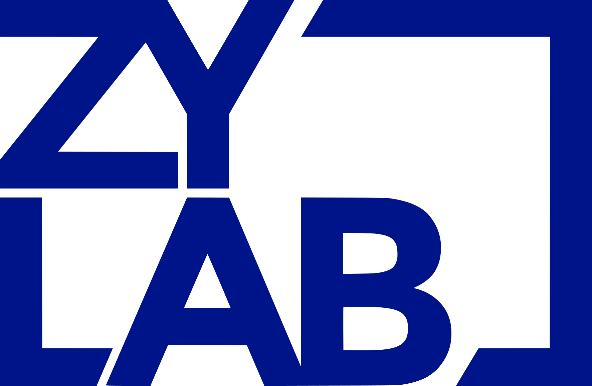

# DesignSystem

The **ZyLAB Design System** (ZDS) includes the resources to create user interfaces consistent with the internal design principles, design language, and best practices. Rather than focusing on pixels, developers can focus on application logic, while designers can focus on user experience, interactions, and flows.
This Design System provides a range of resources for developers, which includes:

- semantic and accessible component markup.
- icons, font, and design guidelines.

## Preview

- https://zylab-official.github.io/zy-lib/

____

## TODO
- Define schematics to easily add new story for component
- Define schematics to extend public-api
- Split Design TOkens to separate pages
- Unify button components
- Fix Actions steps

## Basics

### Angular Libraries 101
- https://angular.io/guide/creating-libraries

### Storybook 101
- https://www.learnstorybook.com/design-systems-for-developers
- https://www.learnstorybook.com/intro-to-storybook/angular/en/simple-component/
- https://storybook.js.org/tutorials/intro-to-storybook/angular/en/get-started/

## Udseful Addons

### Adobe XD
- https://github.com/morgs32/storybook-addon-xd-designs
- https://storybook.js.org/addons/storybook-addon-xd-designs
